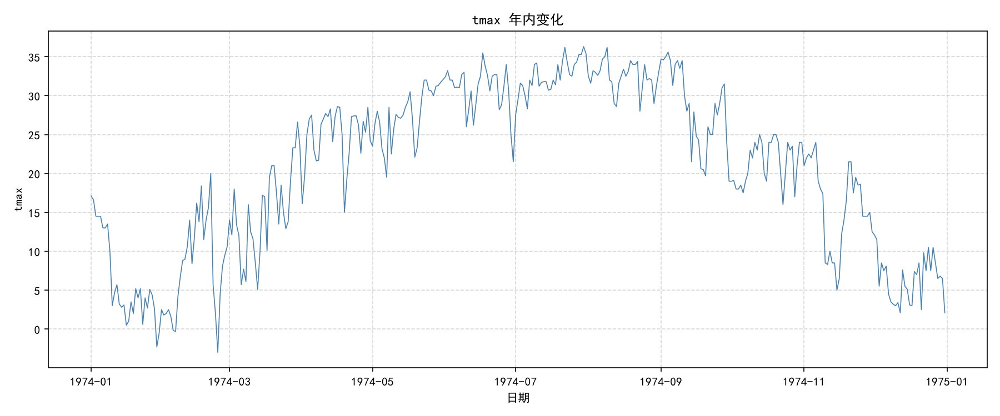
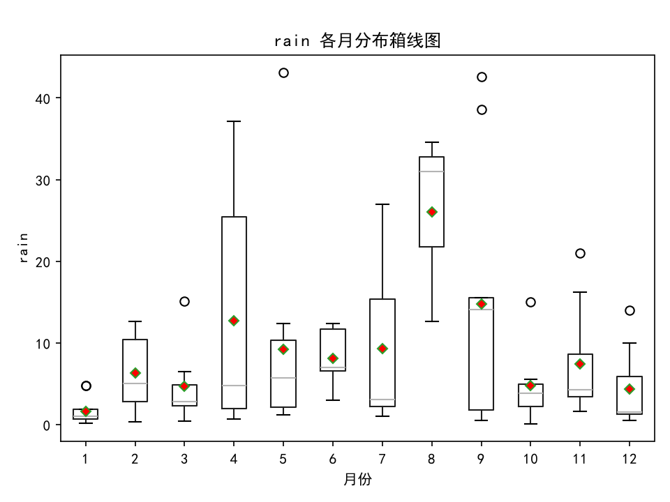

# 水文气象数据清洗与可视化

## 项目简介
对多年逐日水文气象观测数据进行自动清洗、插值及异常值处理，并生成年内变化折线图与月分布箱线图，直观展示气温、降水、风速等要素的分布特征。

## 数据说明
- 原始数据为 `.xls` 格式，包含日期、气温、湿度、风速、降水等气象要素。
- 数据存在缺失值、异常值及表格结构错位问题。

## 技术栈
- Python 3
- Pandas（数据清洗、插值）
- Matplotlib（可视化）
- Git & GitHub（版本控制与展示）

## 运行方法
1. 安装依赖：`pip install -r requirements.txt`
2. 将原始数据文件（`水文数据.xls`）放在项目根目录
3. 运行脚本：`python main.py`
4. 图表自动保存至 `plots/` 文件夹

## 结果示例

